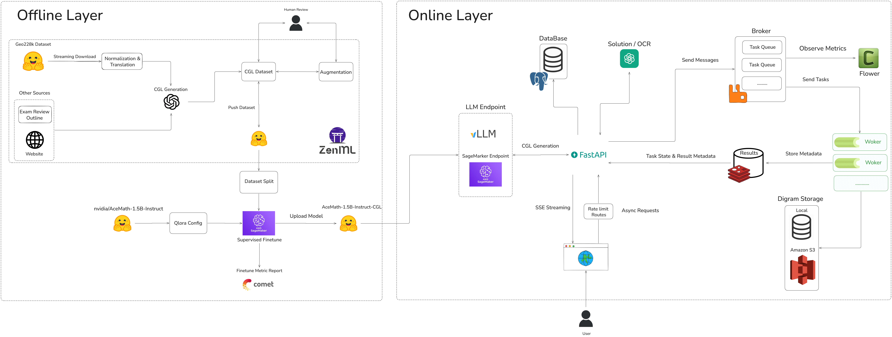

# 🧠 GeoSystem Backend

GeoSystem Backend là hệ thống xử lý bài toán hình học tiếng Viet end-to-end, tu nhan dien ngon ngu tu nhien den sinh bieu dien hinh hoc co cau truc va ve diagram tu dong.

## 🏗️ System Architecture



## 📁 Project Skeleton

```
backend/
  alembic/
  images/
  notebooks/
  pipeline/
  scripts/
  src/
  Makefile
  pyproject.toml
  README.md
```

## ⚙️ How to Run

Install dependencies:

```bash
make install
```

Start services with Docker:

```bash
make docker_up
```

Run API endpoint:

```bash
make endpoint
```

LLM local dev:

```bash
make llm_local
```

Data pipeline examples:

```bash
make data
make generation
make generate_question
```

Deploy to SageMaker:

```bash
make deploy_endpoint
make del_endpoint
```

Deploy guide: [src/infrastructures/aws/deploy/deploy_llm.md](src/infrastructures/aws/deploy/deploy_llm.md)
